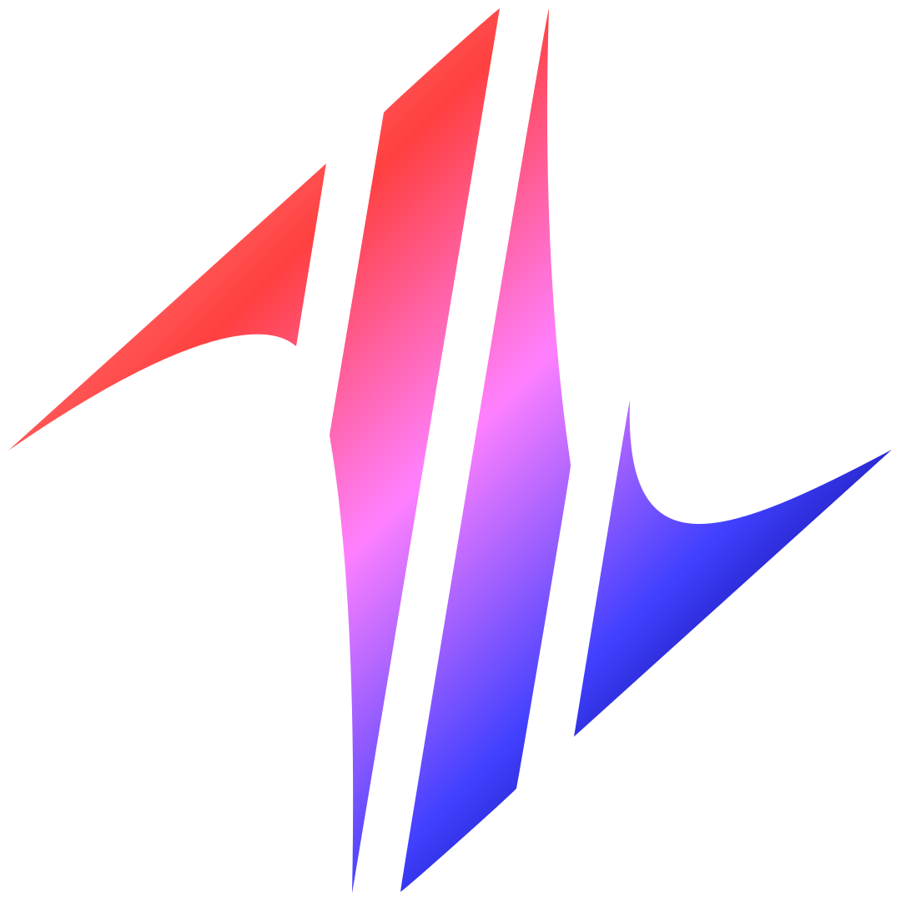
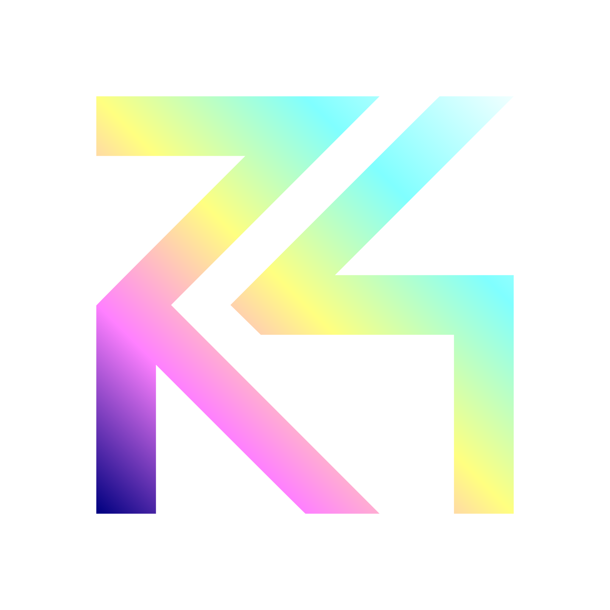
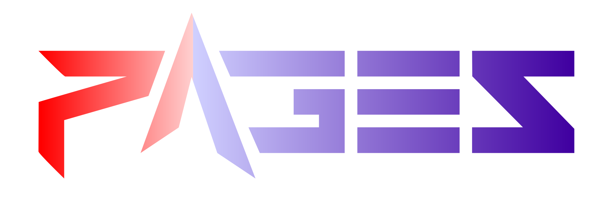
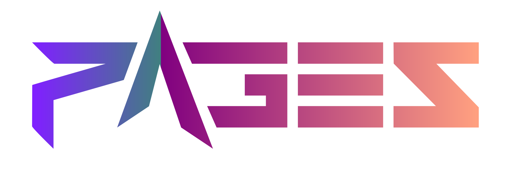

# Icons  

## Showcase  

### [74](https://github.com/74gg)  

  <div>
    
    <!--  -->
  </div>

### [7rs](https://github.com/7rs)  

  <div>
    
    <!--  -->
  </div>

### [Pages](https://github.com/7rs/pages)  

  <div>
    
    
    <!-- 
     -->
  </div>

## Converts to PNG  

  ```sh
  sharp resize "4320" --input [svg] --output [png] --lossless
  ```
